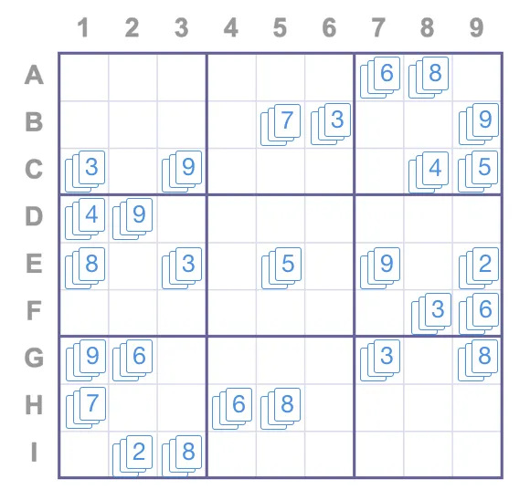
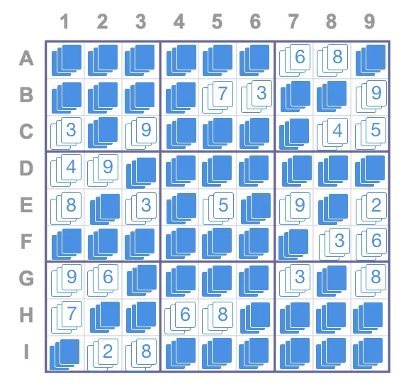
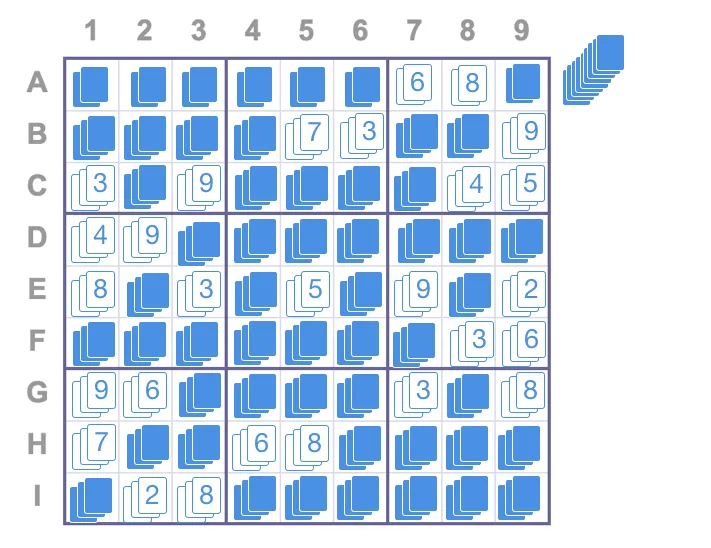

# ZK Intro

Some practical examples that helped me intuitively understand ZK without using any jargon and math

## Example 1
Find a person in a collage. A novel way is to cut a person siluohette on a white cardboard and place it at exact location of collage → as a prover, unless you know location on collage, you cannot prove -> **soundness**. Same proof can be used for any collage → **completeness**. You aren’t disclosing the actual location to the verifier - **zero knowledge**

[Read article](https://blog.goodaudience.com/understanding-zero-knowledge-proofs-through-simple-examples-df673f796d99)

---

## Example 2
2 colors are swapped without person seeing it & then another person has to tell the color → a prover here is trying to prove that someone is not blind → if a person is correctly guessing a color multiple times, there is very little likelihood he is blind. 

Without telling whether a person is blind or not, the experiment verifies that. Again, soundness/completeness and zero knowledge are the core properties of the proof.

[Read article](https://blog.goodaudience.com/understanding-zero-knowledge-proofs-through-simple-examples-df673f796d99)

---

## Example 3
Above examples are both multi-round feedback. A verifier has to repeatedly verify claims → this is not practical in most scenarios, specially in the world of blockchain where user (both prover/verifier) interacts need to be kept to a minimum. 

An alternative example here shows a single proof can be used by any verifier to verify a claim & the proof itself has no time dependency. Intuitively, this makes sense in crypto where the prover and verifier need not be active on-chain at the same time, and the proof is not specific to a specific verifier. These are called succinct/ non-interative roofs.

The sudoku example shows how this can be done. Imagine a sudoku puzzle as follows - challenge is to prove that a person knows the solution to the puzzle without explicitly seeing the proof.

Here, we put 3 cards for all the slots which are known. Then the prover writes answers and places 3 cards in each slot as below

Now the  verifier picks 1 card for each slot in each row → to make a pack 9 stacks of of 9 cards each. He does the same for columns - and then he puts all the box cards together. Together, he gets 27 stacks of 9 cards where verifier has not seen any cards.

After this, a machine randomly shuffles all the 27 stacks and then opens the cards. In each stack, there should not be any duplication → if this is true, then that means, that the prover knows the exact solution to the puzzle. This is a SNARK definition

[Read article](https://blog.goodaudience.com/understanding-zero-knowledge-proofs-through-simple-examples-df673f796d99)

---
## Dark Forest Notes

- Biggest use case of ZKPs that is already in use ⇒ private and public keys. We sign with a private key and share a public key → this is proof to someone that I indeed have signed with my private key
- Three colored graph problem → where the map is filled with 3 colors and same color does not share a common border → proving that I know the exact map can be done by giving color combination of any border repeatedly
- Suppose we have computed `f(secret) -> y` where f is a public function and y is a public output. A ZKP allows us to prove that I know a `secret` such that `f(secret) = y` without revealing the secret.
- Early cryptographers developed one protocol to prove a specific usecase. For eg, one protocol to prove log of a number, one protocol for 3 colored problem, one for private/public keys etc → there was no single proof for arbitary math functions
- `zkSNARK` is a gadget used to generate a ZKP for any mathematical function → this generic nature is what makes this tool powerful
- Suppose I have a hash function `h(x) = x^3 - x + 7` and I want to prove that I know an `x`such that `h(x) = 67`-> the proof should be
    - Linear in time → verifier can prove it whenever they want to
    - Non-interactive → proof should not need further interaction by prover
    
    such a proof is called zkSNARK → **zero knowledge succinct non interactive argument of knowkedge**
    
- **Fog of War Example**
    - Imagine a game where each player has to submit his location → but player doesn’t want everyone to know actual location → so player instead submits a hash of the location
    - Game needs to know that the player does not randomly submit bytes that correspond to a fake location → so the player has to submit a proof that he is providing correct location
    - So players cannot make an illegal move → move too far or too fast to give an undue advantage to players → solution is player submits a zkSNARK

[Read Dark Forest Article](https://blog.zkga.me/intro-to-zksnarks)

---
## Intro to Circom and SnarkJs
- All this is great but we need a tool to build a circuit - a tool that generates a prover key and a way to verify the proof -> preferably on chain. This is where Circom and SnarkJS come into play

- - Circom is a tool that allows us to build a generic proving and verifying key for a given output
- Prover can generate proving key by creating template and passing the output
- Verifier has the proving key and the output
- While introducing, author has mentioned some constraints
    - only addition, multiplication and subtraction operations are present
    - any complex operations → like x^3 have to be broken down as → x^2 * x
    - division/modulo  need to be calculated via base operations
    - All the values are part of a finite field F_p → finite field is constituted by an array of numbers of size `p` . All the numbers are co-primes with p → from `[0, 1, 2, …… p-1]`
- SnarkJS is a library that creates proving and verification code in javascript and solidity, given a Circom template