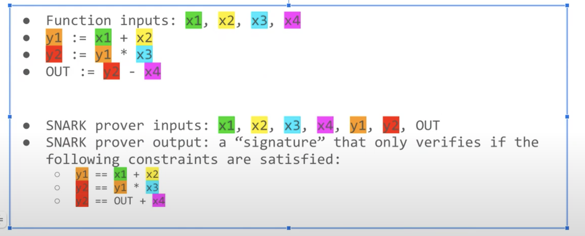

# 0xPARC notes

## Pre-requisites
Read [intro to zk](./intro2zk.md) for an intuitive understanding of ZK 

## Lesson 1 - Intro to ZK
 - ZK Proofs have 3 properties - soundness, completeness and zero knowledge
 - *zero knowledge* - prover response does not reveal anything of underlying info
 - *completeness* - if prover knows underlying info, they will always be able to prove correctly
 - *soundness* - if prover doesn't know the underlying info, they will *eventually* get caught
- example homomorphic encryption - I have `x` and `y` but don't have the compute to do `f(x,y)` -> I can use a private key to encrypt `x` and `y` and send to B, `enc(x)` and `enc(y)`. B can do `f(enc(x),enc(y))` and send it back to me, I can use my key to decrypt and get back `f(x,y)` -> key assumption here is that `enc(f(x,y)) = f(enc(x), enc(y))` -> claim here is homomorphic encryption is like providing a ZK proof for arbitary function


- In essence, homomorphic encryption gives us an important application of where ZK could be used in real life - proving identity etc would essentially be falling into this class of problems.

- `zkSNARKS`  - zk -> zero knowledge; S -> Succinct; N -> Non Interactive; ARK - Argument of Knowledge.

- High level understanding of how to work with zkSNARKs
    - Convert your problem (eg. 3 colored graph) into a function whose inputs we want to hide
    - Execute the function inside homomorphic encryption
    - Roll up the function into a short signature of execution
    - Verify the message on chain (which will be easy to do)

A quick primer on zkSNARKs [here](./zkSNARKs.md). 

---

## Lesson 2 - Circom Workshop
- Example explaining what Circom tries to prove
    `f(x) = (x1 + x2)*x3 - x4`
A zkSNARK is basically a signature that proves that the prover has a tuple `(x1, x2, x3, x4)` such that the result of the computation is a public output `OUT`. A zkSNARK does not tell what individual inputs are but provides a proof that the person who submitted the signature know what they are

- SNARKS have a key primitive - called `constraints`. Every SNARK has some constraints, and constraints are provided in quadratic polynomial (either addition or multiplication)

- Here is a sample circuit



- In the above example, prover has values x1, x2, x3, x4, y1, y2 and generates a signature that only verifies if some set constraints are true

- tech stack
    - [Circom 2.0](https://github.com/iden3/circom) 
    - [SnarkJS](https://github.com/iden3/snarkjs) 

- Circom is a programming language that allows us to write zk Circuits
- SnarkJS is a javascript library that works with the outputs of Circom

- SnarkJS can do things like
    -  generate solidity verifier
    - generate proofs on web browser
    - verify proof generated by circom etc

- How does ZKDapp work?
    - a zkSNARK node is compiled in Circom
    - Circom generates a proving and verification key
    - Proving key is sent to the webapp bundle to generate proofs on specific inputs
    - Verifying key is used on the verifier smart contract to verify this proof

- Discuss the simple [polynomial circuit](../circuits/simple-polynomial.circom) in circom starter kit   
    - note that, `x_squared` and `x_cube` are intermediate outputs that depend on value of `x`
    - they are used to define quadratic constraints 

    ```
          x_squared === x * x;
          x_cubed === x_squared * x;
          out === x_cubed - x + 7;
    ```
    - `===` represents a constraint and `<--` represents assigning a value to a signal. For more on this, refer the [circom notes](./circom.md)

    - On compiling, 3 files are generated for each circuit
        - `*.r1cs` - witness generation program that is able to derive all four values just based on value of `x`
        - `*.vkey.json` - verification key, usually very small. this will go into nodejs back end OR smart contract for verification of a proof
        - `*.wasm`: .wasm` is a web assembly program that implements all the single arrow stuff (assigning signals)
        - `*.zkey` - proving key - goes to client, ie. browser webapp -> this generates proof for specific case
    - above files are in circuits folder - also present in artifacts folder

    - On compiling, we also have this `*.sol` file in contracts folder that has the function `verifyProof` function that verifies a proof for a given set of public signals        

    - this solidity contract basically converts verification key into solidity code

    - If constraints are not properly setup, then the circuit could be buggy - this is one of the key risks when deploying circuits, ie. underconstrained systems. For eg. in the simple polynomical example, if we have the following

    ```
              x_squared <-- x * x;
            x_cubed <-- x_squared * x;
            out <-- x_cubed - x + 7;

            x_squared === x * x;
            // x_cubed === x_squared * x; // suppose this constraint is not defined
            out === x_cubed - x + 7;
    ```
- In the above case, a prover can submit a random x_cubed value that satisfied the `out == x_cuber - x + 7` and get past the verification. The `completeness` of the zkSNARK is violated for this circuit. 

- When possible, use double arrow -> recommendation of Circom

- Discuss the [division.circom](../circuits/division.circom) example shows a case when the assignment differs from constraints. In assignment, we can use division but a constraint cannot have a division (only addition and multiplication are accepted at constraint level). This is why the constraint cleverly converts the division into multiplication

- Discuss the [hash.circom](../circuits/hash.circom) example shows how to use a re-usable template (essentially, a module that can be included). This allows composability in circom. For template syntax, and constraints on how component templates can be instantiated, refer to my [circom notes](./circom.md)

- Hardhat circom will generate a proof for a sample witness -> and then verify that proof against the verification key. When we check the logs of compiling circuit via hardhat, we can see that the proof is generated against a witness and also verified. The witness is in the `<circuit>.json` file. OK on hardhat circom shows that all files were generated and the proof for a witness is generated and verified successfully. 


---

## Lesson 3 - Snark dapps

- SNARKs have a O(1) computation overload for verification. This means that any complex SNARK can be verified at moderate gas

- Basic problem with blockchains
    - smart contracts can't have private state
    - smart contracts can't prove snarks - gas does not make it feasible. They need relayers, ie. offchain machines waiting for requests

- SNARKs allow verifiable computation and private state

- A zk rollup is nothing but an entire blockchain put on SNARKs
    - Put verifier on a decentralized blockchain with a lot of decentralization
    - Since the verification is O(1), we can achieve a cheap blockchain without compromising the security guarantess

- Tornado cash uses Circom to generate circuit that does the mixing that de-links deposit with withdrawal. How does it work, intuitively?

    - A depositor submits amount and `hash(note)` to escrow smart contract
    - Escrow smart contract waits for `N` hashes and once it receives it, it closes all deposits and opens withdrawals
    - Depositor has to prove that he has the pre-image of one of the hashes and also reveal `hash(hash(note))`
    - Every withdrawal, contract stores `hash(hash(note))` so that same withdrawal cannot be replayed
- Above is a simplification of TC, as in real world, TC allows depositors to deposit and withdraw at any time.


- Dark forest example is also interesting:
    - Challenge here is to prove that you are within a distance `X` from another coordinate whose exact location is also unknown
    - So the proof should show that the distance between two points in space `S1`and `S2` (private inputs) is less than `D`. 
    - Objective function in this case: `Dist(S1, S2) <= D`
    - This is necessary to prove that your move is valid without revealing it

- Zero Knowledge ML (zkML)
    - _Problem to solve_: user wants to prove accuracy of his ML model without revealing what it is
    - ML models lose all their edge if their secret sauce is revealed
    - its a lose lose for a model developer if he has to reveal full model
    - using ZK, a user can submit results of the model and accuracy without revealing    actual model
    - This is how this works:
        - Model developer commits to the hash of the model( say `H`) that was developed on test data
        - Model dev hands over the model to the bounty announcer (data owner)
        - Dev proves in a SNARK that model hits z% accuracy on the validation data 
        - To claim reward, encrypt the model, and prove that the private key of the model developer can decrypt the model with hash `H`

 - ZK Identity
    - _Problem to solve_ - prove you are part of something without revealing full identity
    - Ethereum has permissionless identity - private/public key
    - but it is "all or nothing" privacy
    - someone knowing address knows entire on-chain history
    - there is no way to keep your individual identity private but be part of some group

- ZK Group messaging
    - _Problem to solve_: How can you message in a group without revealing your identity -> group just knows message came from one of their group members but don't know the identity
    - This has multiple use-cases, for eg. employee feedback without the fear of being persecuted

- Private airdrop
    - _Problem to solve_: receive airdrop without revealing identity of recipient
    - typical merkle root based airdrop creates a merkle rooty with leafs being user public address and amount
    - to claim, a user gives a proof from a leaf with user address and amount
    - contract marks user address as already claimed to prevent double pay
    - to claim secretly, 
        - smart contract stores merkle root with public keys instead of address
        - use ECDSA circuit to prove I have signed a message with private key corresponding to public key
        - use a nullifier with a hash of ECDSA r and s value to prevent double claims
        - claim from another address

    - Proof of membership is also a very similar problem to stealth airdrops. One example discussed is to join Discord channel without linking address & just by having token X -> a public address linking is like Doxxing oneself.

---

## Lesson 4 - Circom contd.
- Implemented Num2FourBits -> I've generalized this to [Num2NBits](../circuits/num2bits.circom) using shift operators
- Group signatures implementation - problem statement here is that, assuming I am part of a group of N people, can I send a message to the group where the group knows that it is sent by a member of the group but does not know who exactly sent it. 
- We build a circom circuit that takes `N` user public keys, a secret key and a message. Circuit then verifies that the secret key generates a public key which is one of the `N` public keys -> the circuit also attests the public message with the secret key and returns the attested hash as an output.

- I generalized the implementation for N members in a group [here](https://gist.github.com/0kage-eth/cb9521251e6963f96bcd660c0f6d3ebb)
