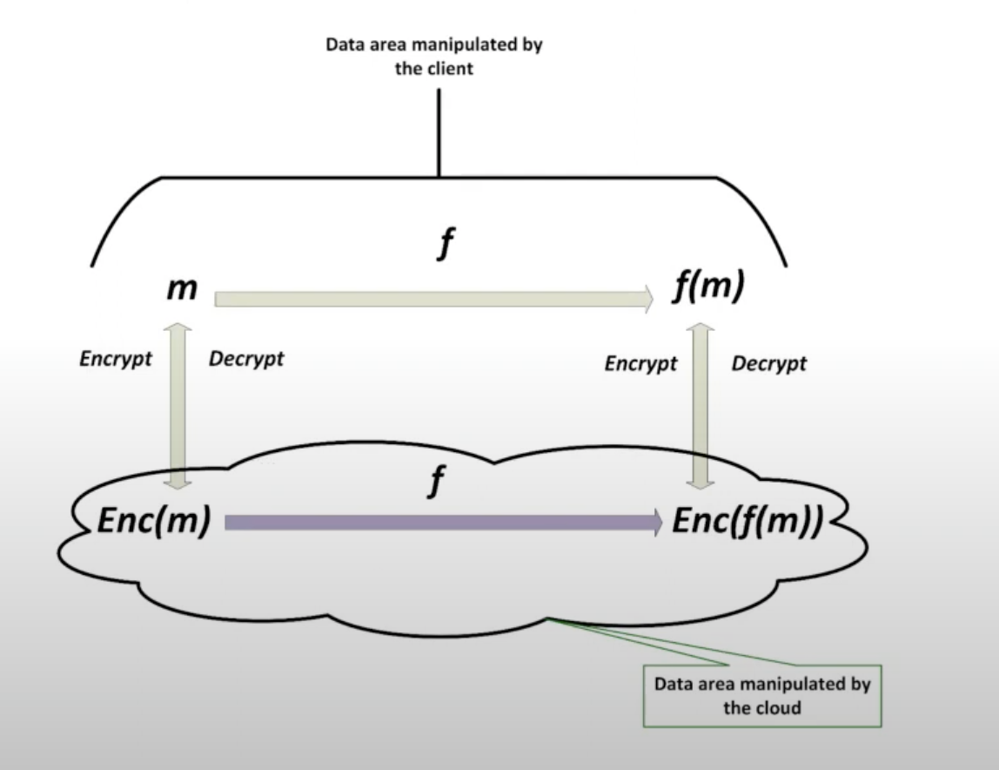

##0xPARC notes

## Lesson 1 - Intro to ZK
 - ZK Proofs have 3 properties - soundness, completeness and zero knowledge
 - *zero knowledge* - prover response does not reveal anything of underlying info
 - *completeness* - if prover knows underlying info, they will always be able to prove correctly
 - *soundness* - if prover doesn't know the underlying info, they will *eventually* get caught
- example homomorphic encryption - I have `x` and `y` but don't have the compute to do `f(x,y)` -> I can use a private key to encrypt `x` and `y` and send to B, `enc(x)` and `enc(y)`. B can do `f(enc(x),enc(y))` and send it back to me, I can use my key to decrypt and get back `f(x,y)` -> key assumption here is that `enc(f(x,y)) = f(enc(x), enc(y))` -> claim here is homomorphic encryption is like providing a ZK proof for arbitary function

- In essence, homomorphic encryption gives us an important application of where ZK could be used in real life - proving identity etc would essentially be falling into this class of problems.

- `zkSNARKS`  - zk -> zero knowledge; S -> Succinct; N -> Non Interactive; ARK - Argument of Knowledge.

- High level understanding of how to work with zkSNARKs
    - Convert your problem (eg. 3 colored graph) into a function whose inputs we want to hide
    - Execute the function inside homomorphic encryption
    - Roll up the function into a short signature of execution
    - Verify the message on chain (which will be easy to do)

A quick primer on zkSNARKs [here](./zkSNARKs.md). 

## Lesson 2 - Circom Workshop